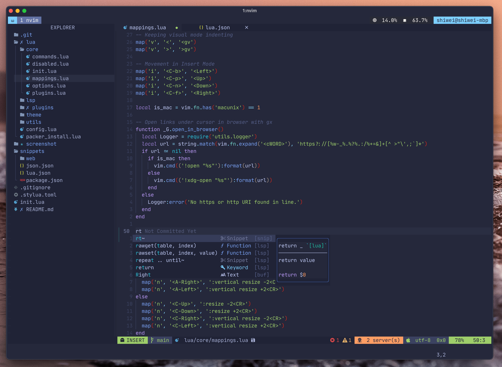
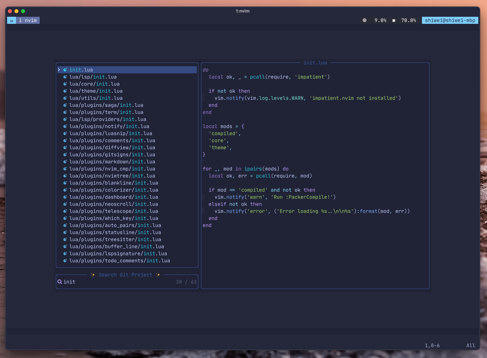
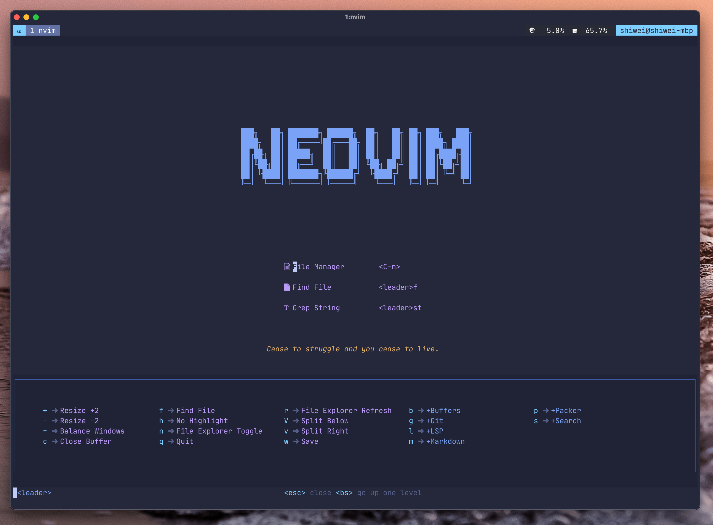

# Neovim Configuration

## Introduction

This repo hosts my Neovim configuration for macOS. `init.lua` is the entry point for Neovim.

## Dependent

This config is tested against [Nvim 0.6.1 release](https://github.com/neovim/neovim/releases/tag/stable).

## Screenshot

### Editor

### Fuzzy find

## Plugins

* Plugin management via [Packer.nvim](https://github.com/wbthomason/packer.nvim).
* Beautiful status line via [lualine.nvim](https://github.com/nvim-lualine/lualine.nvim).
* File tree explorer via [nvim-tree.lua](https://github.com/kyazdani42/nvim-tree.lua).
* Keymap display via [which-key.nvim](https://github.com/folke/which-key.nvim).
* Code highlighting via [nvim-treesitter](https://github.com/nvim-treesitter/nvim-treesitter).
* Color theme via [tokyonight.nvim](https://github.com/folke/tokyonight.nvim).
* Smooth scroll experience via [neoscroll](https://github.com/karb94/neoscroll.nvim).
* Code auto-completion via [nvim-cmp](https://github.com/hrsh7th/nvim-cmp) and [nvim-lspconfig](https://github.com/neovim/nvim-lspconfig).
* Code commenting via [Comment](https://github.com/numToStr/Comment.nvim) and [ts_context_commentstring](https://github.com/JoosepAlviste/nvim-ts-context-commentstring) for jsx or tsx files.
* Animated GUI style notification via [nvim-notify](https://github.com/rcarriga/nvim-notify).
* A snazzy bufferline [bufferline.nvim](https://github.com/akinsho/bufferline.nvim).
* Functional dashboard [dashboard-nvim](https://github.com/glepnir/dashboard-nvim).
* Powerful fuzzy finder [telescope.nvim](https://github.com/nvim-telescope/telescope.nvim).
* Code snippets engine [LuaSnip](https://github.com/L3MON4D3/LuaSnip) and [friendly-snippets](https://github.com/rafamadriz/friendly-snippets).
* ...

## Shortcuts

`<leader>` is `<space>` in my configuration.

| Shortcut  | Mode   | Description   |
|-------------- | -------------- | -------------- |
| `<A-Up>`    | Normal     | Decrease vertical size by 2 rows      |
| `<A-Down>`    | Normal     | Increase vertical size by 2 rows     |
| `<A-Left>`    | Normal     | Decrease horizontal size by 2 columns |
| `<A-Right>`    | Normal     | Increase horizontal size by 2 columns      |
| `<C-b>`    | Insert     |  Move cursor backwards      |
| `<C-p>`    | Insert     |  Move cursor up      |
| `<C-n>`    | Insert     |  Move cursor down      |
| `<C-f>`    | Insert     |  Move cursor forwards      |
| `<`   | Visual     |  Reverse indent      |
| `>`    | Visual     |   Indent     |
| `<A-j>`    | Insert/Visual    |  Move current line/block up     |
| `<A-k>`    | Insert/Visual     | Move current line/block down     |
| `<C-h>`    | Normal     | Equal to `<C-w>h`     |
| `<C-j>`    | Normal     | Equal to `<C-w>j`     |
| `<C-k>`    | Normal     | Equal to `<C-w>k`     |
| `<C-l>`    | Normal     | Equal to `<C-w>l`     |
| `<Tab>`    | Normal     | Next Buffer Tab |
| `<S-Tab>`    | Normal     | Previous Buffer Tab |

Tap `<leader>` key and will get suggestions to complete a key binding with a beautiful popup window. Thanks for
the plugin [which-key.nvim](https://github.com/folke/which-key.nvim).

## Thanks for inspiration

* [@ChristianChiarulli](https://github.com/ChristianChiarulli) for [LunarVim](https://github.com/LunarVim/LunarVim)
* [@jdhao](https://github.com/jdhao) for [nvim-config](https://github.com/jdhao/nvim-config)
* [@CosmicNvim](https://github.com/CosmicNvim) for [CosmicNvim](https://github.com/CosmicNvim/CosmicNvim)
* [@ecosse3](https://github.com/ecosse3) for [nvim](https://github.com/ecosse3/nvim)
